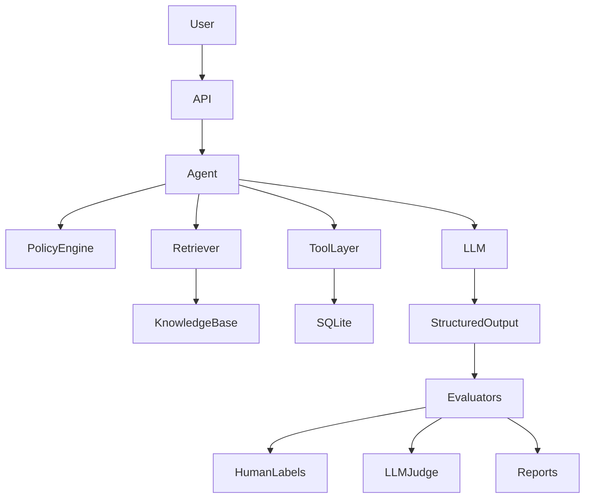

# 🛡️ StrideGuard
## Production-Grade AI Evaluation Engineering Project

<p align="center">


</p>

> **A production-inspired AI Evaluation Engineering project demonstrating how modern LLM systems should be measured, validated, debugged, secured, and continuously improved — not just prompted.**


---

## 👋 Why I Built This


Most AI projects optimize prompts until a demo looks good. StrideGuard exists to answer a harder question: **how do you know an AI system is actually correct, and how do you prove it stayed correct after you changed something?** This project is my answer — built phase by phase, with every claim backed by a reproducible experiment artifact rather than a screenshot of a good conversation.

---

## 📋 Table of Contents

- [Overview](#-overview)
- [Results & Evidence](#-results--evidence)
- [The 18-Phase Curriculum](#-the-18-phase-curriculum)
- [Architecture](#️-architecture)
- [Key Features](#-key-features)
- [Technology Stack](#️-technology-stack)
- [Repository Structure](#-repository-structure)
- [Getting Started](#️-getting-started)
- [Testing & Evaluation](#-testing--evaluation)
- [Failure Gallery](#-failure-gallery)
- [Skills Demonstrated](#-skills-demonstrated)
- [Troubleshooting](#-troubleshooting)
- [Best Practices](#-best-practices)
- [Roadmap](#-roadmap--what-id-do-next)
- [About / Connect](#-about--connect)

---

## 📖 Overview

StrideGuard is a fictional customer-support platform built to teach and demonstrate **AI Evaluation Engineering** — the discipline of measuring, validating, debugging, and improving AI systems, rather than just optimizing prompts.

Modern AI systems need to answer harder questions than "did the chatbot give the right answer?" — did it follow policy, retrieve the right documents, call the right tool, avoid hallucinating, and can failures be reproduced and regression-tested? StrideGuard demonstrates the full lifecycle for answering these:

```
Requirements → Product Contract → Golden Dataset → Deterministic Logic
→ LLM → Evaluation → Human Review → Regression Testing → Deployment Gates
```

**Core principle:** *If something can be verified deterministically, it should never be delegated to an LLM.* Business rules (eligibility, authorization, math, DB mutations, ownership checks) live in deterministic application code. LLMs are reserved for language understanding, reasoning, summarization, and conversation.

⚠️ **This is not a plug-and-play chatbot repo.** It's a learning-first engineering project where each phase builds on the last — useful if you want to understand *why* each component exists, not just run something quickly.

---

## 📊 Results & Evidence


| Metric | Baseline | After fixes | Change |
|---|---|---|---|
| Golden set accuracy | `27/40` | `35/40` | +8 cases (+20 pts) |
| Retrieval Recall@3 | `TODO/TODO` | `TODO/TODO` | — |
| Policy-adherence (deterministic evaluator) | `TODO/TODO` | `TODO/TODO` | — |
| Judge–human agreement (Cohen's κ) | `TODO` | `TODO` | — |
| Promptfoo red-team pass rate | `TODO/TODO` | `TODO/TODO` | — |

**Worked example (recommended by the project guide's demonstration sequence):** pick one real case ID (e.g. `ADDR_CHANGE_045`), and walk it end-to-end — baseline response was wrong → which failure-taxonomy code it hit → what the trace showed → the root cause → the deterministic-code or prompt fix → the regression test that now locks it in. This single narrated example does more for a reader's confidence than the whole metrics table above.


---

## 🎓 The 18-Phase Curriculum

Each phase has a learning objective, a "how this maps to production" section, and an exit criteria checklist — this is what separates the project from a weekend chatbot build.

| # | Phase | What it proves |
|---|---|---|
| 0 | Environment, Reproducibility & Offline Test Strategy | Eval numbers are meaningless without a controlled, reproducible environment |
| 1 | Define the Product Contract Before Building the Model | "Correct" is defined in writing before any model code is written |
| 2 | Create Typed Evaluation Data Models | Structured, typed outputs instead of ad-hoc LLM text parsing |
| 3 | Move Deterministic Policy Decisions Out of the LLM | Authorization, math, and business rules live in code, not prompts |
| 4 | Build the Prompt-Only Structured-Output Baseline | Establishes a measurable starting point before any optimization |
| 5 | Write the First Golden Dataset by Hand | Hand-labeled ground truth, not LLM-generated ground truth |
| 6 | Run and Freeze the Baseline Experiment | Reproducible, timestamped experiment artifacts — never overwritten |
| 7 | Design the Rubric and Perform Real Human Labeling | Human-labeled data with measured inter-rater agreement |
| 8 | Implement Deterministic Evaluators First | Exact-match, retrieval, citation, and tool-call evaluators before any judge |
| 9 | Add Local RAG and Evaluate Retrieval Separately | Retrieval quality (Recall@K, Precision@K) measured independent of generation |
| 10 | Build a Sandboxed Action Agent and Evaluate State | Agent tool-selection and end-state correctness, not just chat quality |
| 11 | Build and Calibrate an LLM-as-a-Judge | Judge outputs validated against human labels before being trusted |
| 12 | Run Controlled Experiments and Protect a Holdout Set | Rigorous experiment design with a holdout set that's never tuned against |
| 13 | Add Open-Source Tracing with Phoenix | Full observability: prompts, retrieval, tool calls, latency, eval metadata |
| 14 | Add Security Regression Tests and Promptfoo Red Teaming | Prompt-injection, jailbreak, and unsafe-tool-use resistance testing |
| 15 | Put Trustworthy Release Gates in CI | Quality/security thresholds enforced automatically on every PR |
| 16 | Run a Structured User Pilot | Separates "users liked it" from "the system was correct" |
| 17 | Produce the Portfolio Evidence | Converts the project into evidence an interviewer can actually evaluate |

<details>
<summary><b>Full phase-by-phase run commands</b></summary>

```bash
uv run pytest tests/unit                    # Phase 0–3: deterministic rules (no LLM needed)
uv run python scripts/run_baseline.py       # Phase 4: prompt-only baseline
uv run python scripts/validate_dataset.py   # Phase 5: golden dataset validation
uv run python scripts/run_experiment.py     # Phase 6/12: freeze/compare experiments
uv run python scripts/export_for_labeling.py  # Phase 7: human labeling export
uv run python apps/labeling_app.py          # Phase 7: Streamlit labeling UI
uv run python scripts/run_deterministic_evals.py  # Phase 8: deterministic evaluators
uv run python scripts/ingest_knowledge.py   # Phase 9: index policy docs
uv run python scripts/retrieval_eval.py     # Phase 9: retrieval metrics
uv run python scripts/run_agent_experiment.py  # Phase 10: agent evaluation
uv run python scripts/calibrate_judge.py    # Phase 11: LLM-as-judge calibration
uv run python scripts/create_dataset_splits.py  # Phase 12: dev/holdout split
uv run python scripts/agreement_report.py   # Phase 7/11: labeler & judge agreement
uv run python scripts/compare_experiments.py  # Phase 12: controlled comparisons
uv run python scripts/summarize_feedback.py # Phase 16: pilot feedback triage
uv run python scripts/add_regression_case.py  # Phase 16→17: pilot failure → regression test
```
</details>

---

## 🏗️ Architecture



**Request flow:** Customer → API → Support Agent → Retrieve Knowledge → Deterministic Policy Engine → LLM → Tool Calls → Response → Evaluation Pipeline → Metrics Dashboard.

Evaluation happens **after** inference, never inside the LLM — this keeps every stage observable and experiments reproducible.

**Design principles:**
1. **Deterministic before probabilistic** — time math, auth, ownership, and policy boundaries are code, not prompts.
2. **Version everything** — prompts, knowledge, datasets, judges, and rubrics all version independently for reproducible experiments.
3. **Separate product from model** — requirements live in product docs, behavior in prompts, correctness in evaluators.
4. **Every failure should be explainable** — what failed, why, which component, is it reproducible, can it become a regression test.

---

## ⭐ Key Features

- Typed AI pipelines using Pydantic v2, structured LLM outputs
- Deterministic policy engine + local RAG pipeline + sandboxed agent architecture
- Human evaluation workflow with measured inter-rater agreement
- Deterministic evaluators (exact-match, retrieval, citation validity, tool-call correctness) + calibrated LLM-as-a-Judge
- Experiment tracking with frozen, timestamped, never-overwritten artifacts
- Phoenix observability (full request tracing) + Promptfoo red teaming (prompt injection, jailbreaks, unsafe tool use)
- CI/CD evaluation gates (PR → nightly → release tiers), offline-first testing strategy
- Structured user pilot with a feedback-triage pipeline that converts real failures into regression tests
- Provider abstraction (Groq / Gemini) — swap models via env vars, zero code changes

---

## 🛠️ Technology Stack

| Category | Technology |
|-----------|------------|
| Language | Python 3.11+ |
| LLM Framework | LangChain (+ LangChain Agents) |
| Validation | Pydantic v2 |
| Testing | Pytest |
| Embeddings | Sentence Transformers |
| Vector Database | Qdrant |
| API | FastAPI |
| Database | SQLite |
| Tracing | Phoenix |
| Security | Promptfoo |
| CI | GitHub Actions |
| Package Manager | uv |

---

## 📂 Repository Structure

```
strideguard/
├── apps/                   # labeling_app.py, pilot_app.py, agent_demo.py, rag_demo.py
├── data/                   # products.json — fictional product catalog
├── docs/                   # Product contract, architecture, learning log, guides
├── evals/
│   ├── datasets/           # dev.jsonl, holdout.jsonl — golden cases, never overwritten
│   ├── failure_taxonomy.yaml
│   ├── human_labels/       # per rubric version
│   └── rubrics/            # labeling_guide_v1.md, rubric_v1.yaml
├── knowledge/policies/     # versioned fictional business policies (products, returns, security, shipping)
├── scripts/                # run/compare experiments, evaluators, calibration, dataset splits
├── src/strideguard/        # actions, agent, api, datasets, db, evaluators, experiment,
│                           # judge, knowledge, llm_factory, metrics, models, observability,
│                           # policy_engine, rag, retrieval, settings, support, tools
├── tests/                  # unit/ (deterministic logic) and integration/ (external systems)
├── pyproject.toml
├── Makefile
├── docker-compose.phoenix.yml
└── promptfoo.config.yaml
```

`evals/` is the most important folder — evaluation artifacts (datasets, labels, rubrics) are first-class citizens that evolve independently from prompts. `knowledge/` files are the application's versioned source of truth, so historical experiments stay reproducible.

**Module dependency flow** (one direction, low-level modules never depend on orchestration):
`Models → PolicyEngine → Support → Agent → Evaluators → Experiments`, with `Knowledge → Retriever → Agent` and `Agent → Judge`.

**Recommended reading order:** README → Product Contract → Knowledge Base → Typed Models → Policy Engine → Prompt Pipeline → Golden Dataset → Evaluators → RAG → Agent → Judge → Experiments → Tracing → CI/CD.

If short on time, the essence of the project is: `models.py` → `policy_engine.py` → `evaluators.py` → `scripts/run_experiment.py`.

---

## 📋 Prerequisites

| Tool | Version | Purpose |
|------|---------|----------|
| Python | 3.11+ | Main language |
| Git | Latest | Version control |
| uv | Latest | Dependency management |
| Docker (optional) | Latest | Phoenix observability |
| Make (optional) | — | Simplified dev commands |

Tested on Windows 11, Ubuntu 22.04+, and macOS Sonoma+.

---

## ▶️ Getting Started

```bash
# Clone
git clone https://github.com/<username>/strideguard.git
cd strideguard

# Install (uv recommended)
uv sync --extra dev --extra evals
# or with pip:
python -m venv .venv && source .venv/bin/activate && pip install -e ".[dev,evals]"

# Configure environment
cp .env.example .env
```

`.env` example (only configure the providers you intend to use):
```env
GROQ_API_KEY=your_key_here
GEMINI_API_KEY=your_key_here
OPENAI_API_KEY=
QDRANT_URL=http://localhost:6333
PHOENIX_COLLECTOR_ENDPOINT=http://localhost:6006
```

**Setup order:** Clone → Install → Configure `.env` → Unit Tests → Baseline → Evaluators → Experiments → Phoenix → Promptfoo. This verifies deterministic components before enabling LLM-dependent functionality.

### Run phase-by-phase

```bash
uv run pytest tests/unit                    # Phase 0–3: deterministic rules (no LLM needed)
uv run python scripts/run_baseline.py       # Phase 4: prompt pipeline baseline
uv run python scripts/run_deterministic_evals.py  # Phase 8: deterministic evaluators
uv run python scripts/run_experiment.py     # Phase 6/12: experiment suite
uv run python apps/rag_demo.py              # Phase 9: RAG pipeline
uv run python apps/agent_demo.py            # Phase 10: agent
```

See the [full phase-by-phase commands](#-the-18-phase-curriculum) above for the complete 18-phase run sequence.

---

## 🧪 Testing & Evaluation

```bash
uv run pytest                     # full suite
uv run pytest tests/unit          # unit only
uv run pytest tests/integration   # integration only
uv run pytest --cov=src           # coverage

# Individual evaluators
python scripts/evaluate_policy.py
python scripts/evaluate_rag.py       # Recall@K, Precision@K, context utilization, citation accuracy
python scripts/evaluate_agent.py     # tool selection/args, action correctness, failure recovery
python scripts/evaluate_judge.py     # helpfulness, faithfulness, groundedness, policy adherence

python scripts/load_knowledge.py     # index policy docs into the vector DB
python scripts/run_judge.py          # LLM-as-a-Judge
```

Experiments write reproducible, timestamped artifacts (never overwrite previous runs):
```
experiments/2026-08-03/{metrics.json, responses.json, judge_scores.json, summary.md}
```

**Phoenix (tracing):**
```bash
docker compose -f docker-compose.phoenix.yml up
```
Traces cover prompt, retrieved docs, tool calls, latency, token usage, response, and eval metadata.

**Promptfoo (security):**
```bash
promptfoo eval
```
Checks prompt injection, jailbreaks, sensitive data exposure, hallucination resistance, unsafe tool usage. Run before every release.

**CI (every PR):** Lint → Unit Tests → Integration Tests → Evaluators → Security → Build → Merge — prevents evaluation regressions from reaching production, via a three-tier PR / nightly / release gate structure.

**Code quality:**
```bash
ruff format .   # format
ruff check .    # lint
pyright         # type check
```

---

## 🖼️ Failure Gallery


| Case ID | Failure category | Root cause | Fix | Regression status |
|---|---|---|---|---|
| `ADDR_CHANGE_045` | `POLICY_WRONG` | Model applied a general shipping policy instead of the address-change-specific rule | Moved the rule into the deterministic policy engine | ✅ Locked in as golden case |
| `TODO` | `TODO` | `TODO` | `TODO` | `TODO` |

---

## 🧠 Skills Demonstrated

For anyone scanning this repo for role fit — LLM evaluation & eval-driven development, RAG system design & retrieval metrics, LLM agent architecture & tool-calling, LLM-as-a-Judge design & calibration against human labels, deterministic policy engineering, typed Python (Pydantic v2), observability/tracing (Phoenix), AI red-teaming & security testing (Promptfoo), experiment design (holdout sets, regression testing), CI/CD for ML systems, and human-in-the-loop labeling workflows.

---

## 🐞 Troubleshooting

| Issue | Fix |
|---|---|
| Import errors | `pip install -e .` (editable install) |
| Missing env vars | Verify `.env` exists (`cat .env`) |
| Vector DB not running | `docker compose up` before retrieval experiments |
| Phoenix not collecting traces | Check Docker is running, collector endpoint matches `.env`, container is healthy |
| Evaluation failures | Don't change prompts first — inspect retrieved docs, validate deterministic policies, review experiment artifacts, compare against previous runs, then identify the regression source. Evaluation should drive prompt changes, not intuition. |

---

## 💡 Best Practices

✅ Keep deterministic logic outside prompts · ✅ Treat prompts as versioned artifacts · ✅ Version evaluation datasets · ✅ Record every experiment · ✅ Never modify historical evaluation data · ✅ Prefer adding new evaluators over changing old metrics · ✅ Keep business policies independent from prompts

Every new feature should include: unit tests, evaluation updates, documentation, and experiment results (if applicable).

---

## 🗺️ Roadmap / What I'd Do Next

- [ ] Interactive eval dashboard (Streamlit/Gradio) to filter cases by failure code and inspect traces
- [ ] A formal model card (HuggingFace/Google template) summarizing intended use, evaluation results, and limitations
- [ ] Cost analysis: total API spend, cost per case, cost per correct answer
- [ ] Pre-commit secret scanning + dependency hash locking (`uv lock`)

---

## 🙋 About / Connect


Built by **Aman Kumar Srivastava** as a deep dive into production AI evaluation engineering.

- 💼 LinkedIn: `https://www.linkedin.com/in/aman-kumar-srivastava-ml/`
- 📬 Open to conversations about AI evaluation, LLMOps, and applied ML roles — reach out at `amanksr45@gmail.com`

If you're working on eval systems too, or want to compare notes on any of the 18 phases, I'd genuinely like to hear from you.
