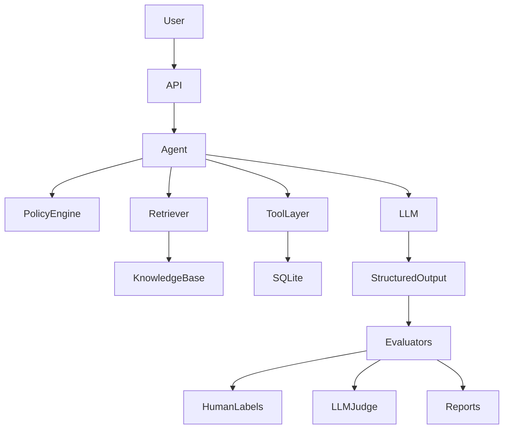

# 🛡️ StrideGuard
## Production-Grade AI Evaluation Engineering Project

<p align="center">


</p>

> **A production-inspired AI Evaluation Engineering project demonstrating how modern LLM systems should be built, evaluated, observed, secured, and continuously improved.**

---

## 📖 Overview

StrideGuard is a fictional customer-support platform built to teach **AI Evaluation Engineering** — the discipline of measuring, validating, debugging, and improving AI systems, rather than just optimizing prompts.

Modern AI systems need to answer harder questions than "did the chatbot give the right answer?" — did it follow policy, retrieve the right documents, call the right tool, avoid hallucinating, and can failures be reproduced and regression-tested? StrideGuard demonstrates the full lifecycle for answering these:

```
Requirements → Product Contract → Golden Dataset → Deterministic Logic
→ LLM → Evaluation → Human Review → Regression Testing → Deployment Gates
```

**Core principle:** *If something can be verified deterministically, it should never be delegated to an LLM.* Business rules (eligibility, authorization, math, DB mutations, ownership checks) live in deterministic application code. LLMs are reserved for language understanding, reasoning, summarization, and conversation.

⚠️ **This is not a plug-and-play chatbot repo.** It's a learning-first engineering project where each phase builds on the last — useful if you want to understand *why* each component exists, not just run something quickly.

---

## 🚀 What You Will Learn

Deterministic policy engines · typed structured outputs · golden evaluation datasets · human labeling workflows · deterministic evaluators · retrieval evaluation · RAG systems · AI agents & tool calling · LLM-as-a-Judge · experiment tracking · Phoenix tracing · Promptfoo security testing · CI/CD evaluation gates · regression testing

---

## 🏗️ Architecture



**Request flow:** Customer → API → Support Agent → Retrieve Knowledge → Deterministic Policy Engine → LLM → Tool Calls → Response → Evaluation Pipeline → Metrics Dashboard.

Evaluation happens **after** inference, never inside the LLM — this keeps every stage observable and experiments reproducible.

**Design principles:**
1. **Deterministic before probabilistic** — time math, auth, ownership, and policy boundaries are code, not prompts.
2. **Version everything** — prompts, knowledge, datasets, judges, and rubrics all version independently for reproducible experiments.
3. **Separate product from model** — requirements live in product docs, behavior in prompts, correctness in evaluators.
4. **Every failure should be explainable** — what failed, why, which component, is it reproducible, can it become a regression test.

---

## ⭐ Key Features

- Typed AI pipelines using Pydantic v2, structured LLM outputs
- Deterministic policy engine + local RAG pipeline + agent architecture
- Human evaluation workflow, automated evaluators, LLM-as-a-Judge
- Experiment tracking, Phoenix observability, Promptfoo red teaming
- CI/CD evaluation gates, offline-first testing strategy
- Provider abstraction (Groq / Gemini)

---

## 🛠️ Technology Stack

| Category | Technology |
|-----------|------------|
| Language | Python 3.11+ |
| LLM Framework | LangChain (+ LangChain Agents) |
| Validation | Pydantic v2 |
| Testing | Pytest |
| Embeddings | Sentence Transformers |
| Vector Database | Qdrant |
| API | FastAPI |
| Database | SQLite |
| Tracing | Phoenix |
| Security | Promptfoo |
| CI | GitHub Actions |
| Package Manager | uv |

---

## 📂 Repository Structure

```
strideguard/
├── apps/        # Thin demo/pilot apps (human labeling UI, RAG demo, agent demo)
├── data/        # Business data — product catalog, seed/demo datasets
├── docs/        # Product contract, architecture, learning log, guides
├── evals/       # Datasets, human_labels, rubrics, failure_taxonomy.yaml
├── knowledge/   # Versioned fictional business policies (shipping, returns, security, products)
├── scripts/     # Automation: run/compare experiments, evaluators, dataset validation
├── src/strideguard/  # All production code
├── tests/       # unit/ (deterministic logic) and integration/ (external systems)
├── pyproject.toml
├── Makefile
├── docker-compose.phoenix.yml
└── promptfoo.config.yaml
```

`evals/` is the most important folder — evaluation artifacts (datasets, labels, rubrics) are first-class citizens that evolve independently from prompts. `knowledge/` files are the application's versioned source of truth, so historical experiments stay reproducible.

**Module dependency flow** (one direction, low-level modules never depend on orchestration):
`Models → PolicyEngine → Support → Agent → Evaluators → Experiments`, with `Knowledge → Retriever → Agent` and `Agent → Judge`.

**Recommended reading order:** README → Product Contract → Knowledge Base → Typed Models → Policy Engine → Prompt Pipeline → Golden Dataset → Evaluators → RAG → Agent → Judge → Experiments → Tracing → CI/CD.

If short on time, the essence of the project is: `models.py` → `policy_engine.py` → `evaluators.py` → `scripts/run_experiment.py`.

---

## 📋 Prerequisites

| Tool | Version | Purpose |
|------|---------|----------|
| Python | 3.11+ | Main language |
| Git | Latest | Version control |
| uv | Latest | Dependency management |
| Docker (optional) | Latest | Phoenix observability |
| Make (optional) | — | Simplified dev commands |

Tested on Windows 11, Ubuntu 22.04+, and macOS Sonoma+.

---

## ▶️ Getting Started

```bash
# Clone
git clone https://github.com/<username>/strideguard.git
cd strideguard

# Install (uv recommended)
uv sync --extra dev --extra evals
# or with pip:
python -m venv .venv && source .venv/bin/activate && pip install -e ".[dev,evals]"

# Configure environment
cp .env.example .env
```

`.env` example (only configure the providers you intend to use):
```env
GROQ_API_KEY=your_key_here
GEMINI_API_KEY=your_key_here
OPENAI_API_KEY=
QDRANT_URL=http://localhost:6333
PHOENIX_COLLECTOR_ENDPOINT=http://localhost:6006
```

**Setup order:** Clone → Install → Configure `.env` → Unit Tests → Baseline → Evaluators → Experiments → Phoenix → Promptfoo. This verifies deterministic components before enabling LLM-dependent functionality.

### Run phase-by-phase

```bash
uv run pytest tests/unit                    # Phase 1: deterministic rules (no LLM needed)
uv run python scripts/run_baseline.py       # Phase 2: prompt pipeline baseline
uv run python scripts/run_evaluators.py     # Phase 3: deterministic evaluators
uv run python scripts/run_experiment.py     # Phase 4: experiment suite
uv run python apps/rag_demo.py              # Phase 5: RAG pipeline
uv run python apps/agent_demo.py            # Phase 6: agent
```

---

## 🧪 Testing & Evaluation

```bash
uv run pytest                     # full suite
uv run pytest tests/unit          # unit only
uv run pytest tests/integration   # integration only
uv run pytest --cov=src           # coverage

# Individual evaluators
python scripts/evaluate_policy.py
python scripts/evaluate_rag.py       # Recall@K, Precision@K, context utilization, citation accuracy
python scripts/evaluate_agent.py     # tool selection/args, action correctness, failure recovery
python scripts/evaluate_judge.py     # helpfulness, faithfulness, groundedness, policy adherence

python scripts/load_knowledge.py     # index policy docs into the vector DB
python scripts/run_judge.py          # LLM-as-a-Judge
```

Experiments write reproducible, timestamped artifacts (never overwrite previous runs):
```
experiments/2026-08-03/{metrics.json, responses.json, judge_scores.json, summary.md}
```

**Phoenix (tracing):**
```bash
docker compose -f docker-compose.phoenix.yml up
```
Traces cover prompt, retrieved docs, tool calls, latency, token usage, response, and eval metadata.

**Promptfoo (security):**
```bash
promptfoo eval
```
Checks prompt injection, jailbreaks, sensitive data exposure, hallucination resistance, unsafe tool usage. Run before every release.

**CI (every PR):** Lint → Unit Tests → Integration Tests → Evaluators → Security → Build → Merge — prevents evaluation regressions from reaching production.

**Code quality:**
```bash
ruff format .   # format
ruff check .    # lint
pyright         # type check
```

---

## 🐞 Troubleshooting

| Issue | Fix |
|---|---|
| Import errors | `pip install -e .` (editable install) |
| Missing env vars | Verify `.env` exists (`cat .env`) |
| Vector DB not running | `docker compose up` before retrieval experiments |
| Phoenix not collecting traces | Check Docker is running, collector endpoint matches `.env`, container is healthy |
| Evaluation failures | Don't change prompts first — inspect retrieved docs, validate deterministic policies, review experiment artifacts, compare against previous runs, then identify the regression source. Evaluation should drive prompt changes, not intuition. |

---

## 💡 Best Practices

✅ Keep deterministic logic outside prompts · ✅ Treat prompts as versioned artifacts · ✅ Version evaluation datasets · ✅ Record every experiment · ✅ Never modify historical evaluation data · ✅ Prefer adding new evaluators over changing old metrics · ✅ Keep business policies independent from prompts

Every new feature should include: unit tests, evaluation updates, documentation, and experiment results (if applicable).
