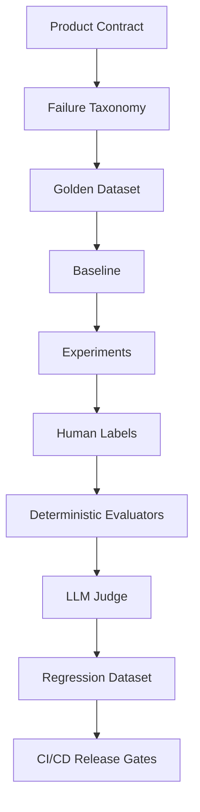
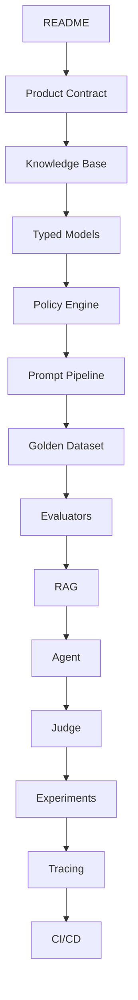
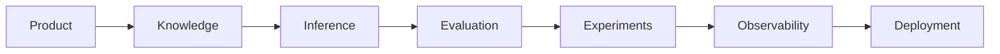
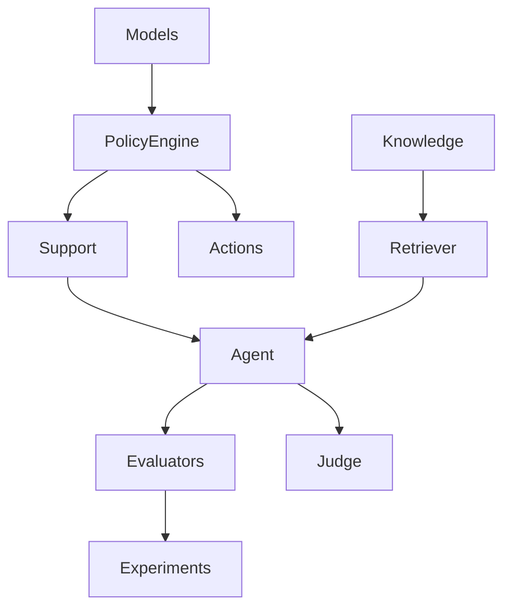
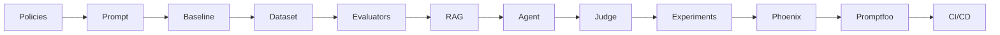

# 🛡️ StrideGuard
## Production-Grade AI Evaluation Engineering Project

<p align="center">


</p>

> **A production-inspired AI Evaluation Engineering project that demonstrates how modern LLM systems should be built, evaluated, observed, secured, and continuously improved.**

---

# 📖 Overview

Large Language Models are no longer evaluated simply by asking:

> *"Did the chatbot give the correct answer?"*

Modern AI systems must answer much harder questions:

- Did the model follow business policy?
- Did retrieval return the correct documents?
- Did the agent mutate the database correctly?
- Did the model hallucinate?
- Did it call the correct tool?
- Can we reproduce this result?
- Can we detect regressions after changing prompts?
- Can we automatically block unsafe releases?

These are **AI Evaluation Engineering** problems.

StrideGuard is a fictional customer-support platform built specifically to teach these concepts through a realistic production-style architecture.

Instead of optimizing prompts, this repository focuses on **measuring, validating, debugging, and improving AI systems using engineering principles.**

---

# 🎯 Why This Project Exists

Most AI tutorials follow a familiar pattern:

```
Prompt
    ↓
LLM
    ↓
Response
```

This workflow is sufficient for demos, but it breaks down in production.

Production AI systems require significantly more engineering:

```
Requirements
        ↓
Product Contract
        ↓
Golden Dataset
        ↓
Deterministic Logic
        ↓
LLM
        ↓
Evaluation
        ↓
Human Review
        ↓
Regression Testing
        ↓
Deployment Gates
```

StrideGuard demonstrates this complete lifecycle.

The project intentionally emphasizes **evaluation before optimization**, ensuring that every improvement can be measured rather than assumed.

---

# 🚀 What You Will Learn

Unlike traditional GenAI repositories that focus only on prompting, this repository teaches the complete lifecycle of production AI systems.

By completing this project, you will understand how to build:

- Deterministic policy engines
- Production-ready prompt pipelines
- Typed structured outputs
- Golden evaluation datasets
- Human labeling workflows
- Deterministic evaluators
- Retrieval evaluation
- RAG systems
- AI Agents
- Tool calling
- LLM-as-a-Judge pipelines
- Experiment tracking
- Phoenix tracing
- Promptfoo security testing
- CI/CD evaluation gates
- Regression testing pipelines

---

# ⚠️ This is NOT a Plug-and-Play Project

If your goal is to clone a repository and immediately run an AI chatbot, this project is probably **not** what you're looking for.

StrideGuard is intentionally designed as a **learning-first engineering project**.

Each phase introduces a new concept that builds upon previous phases.

Nothing is hidden behind frameworks.

Instead of giving you abstractions, this repository encourages you to understand:

- Why each component exists
- Why deterministic logic belongs outside the LLM
- Why evaluation comes before optimization
- Why datasets are versioned
- Why prompts are treated like software artifacts
- Why AI systems require observability
- Why security testing is mandatory
- Why production AI requires regression testing

Every engineering decision is documented.

The objective is **understanding**, not merely execution.

---

# 💡 Repository Philosophy

This repository follows one central engineering principle:

> **If something can be verified deterministically, it should never be delegated to an LLM.**

For example:

✅ Business rules

- Eligibility windows
- Authorization
- Mathematical calculations
- Database mutations
- Ownership validation

belong inside deterministic application code.

Meanwhile,

LLMs should focus on:

- Language understanding
- Reasoning
- Summarization
- Explanation
- Natural conversation

This separation dramatically improves reliability while making failures easier to debug.

---

# 🏗️ High-Level Architecture

```mermaid
graph TD

User

--> API

API

--> Agent

Agent

--> PolicyEngine

Agent

--> Retriever

Retriever

--> KnowledgeBase

Agent

--> LLM

Agent

--> Tool Layer

Tool Layer

--> SQLite

LLM

--> Structured Output

Structured Output

--> Evaluators

Evaluators

--> Human Labels

Evaluators

--> LLM Judge

Evaluators

--> Reports
```

---

# 🔄 End-to-End System Flow

```mermaid
flowchart LR

Customer

-->

API

-->

Support Agent

-->

Retrieve Knowledge

-->

Deterministic Policy Engine

-->

LLM

-->

Tool Calls

-->

Response

-->

Evaluation Pipeline

-->

Metrics Dashboard
```

---

# 🧠 AI Evaluation Lifecycle

Unlike traditional AI projects, StrideGuard continuously evaluates every stage of the system.



---

# ⭐ Key Features

- Typed AI pipelines using Pydantic
- Structured LLM outputs
- Deterministic policy engine
- Local RAG pipeline
- Agent architecture
- Human evaluation workflow
- Automated evaluators
- LLM-as-a-Judge
- Experiment tracking
- Phoenix observability
- Promptfoo red teaming
- CI/CD evaluation gates
- Offline-first testing strategy
- Provider abstraction (Groq / Gemini)
- Production-inspired architecture

---

# 🛠️ Technology Stack

| Category | Technology |
|-----------|------------|
| Language | Python 3.11+ |
| LLM Framework | LangChain |
| Validation | Pydantic v2 |
| Testing | Pytest |
| Embeddings | Sentence Transformers |
| Vector Database | Qdrant |
| Agent Framework | LangChain Agents |
| API | FastAPI |
| Database | SQLite |
| Tracing | Phoenix |
| Security | Promptfoo |
| CI | GitHub Actions |
| Package Manager | uv |

---

# 📂 Repository Structure

```
strideguard/

├── apps/
├── data/
├── docs/
├── evals/
├── knowledge/
├── scripts/
├── src/
│   └── strideguard/
├── tests/
│
├── README.md
├── pyproject.toml
├── Makefile
├── docker-compose.phoenix.yml
└── promptfoo.config.yaml
```

The following sections of this README explain every directory, module, architectural decision, and evaluation component in detail.

---

---

# 📚 How to Read This Repository

This repository is intentionally **not organized around features**. Instead, it follows the lifecycle of building, evaluating, and improving a production AI system.

Each module exists to teach one engineering concept.

If you read files randomly, you'll understand individual implementations but miss the reasoning behind the architecture.

Instead, follow the learning path below.

---

# 🎓 Recommended Reading Order

The repository is designed to be explored in the following sequence.



Every module builds upon concepts introduced in previous modules.

---

# 👨‍💻 Reading Paths

Different readers have different goals.

Choose the path that best matches your objective.

| You are... | Read |
|------------|------|
| Recruiter | README → Architecture → Features |
| Hiring Manager | README → Policy Engine → Evaluators |
| Software Engineer | Models → Policy Engine → Tests |
| ML Engineer | Dataset → RAG → Judge |
| GenAI Engineer | Prompt → Agent → Evaluators |
| AI Researcher | Judge → Metrics → Experiments |
| Student | Follow every phase sequentially |

---

# ⏱️ If You Only Have 10 Minutes

Read these files.

```
README

↓

src/strideguard/models.py

↓

src/strideguard/policy_engine.py

↓

src/strideguard/evaluators.py

↓

scripts/run_experiment.py
```

These represent the core engineering ideas of the project.

---

# ⏱️ If You Have 30 Minutes

Read the repository phase-by-phase.

```
README

↓

Knowledge

↓

Models

↓

Policy Engine

↓

Prompt Pipeline

↓

Datasets

↓

Evaluators

↓

Experiments

↓

Judge

↓

Tracing
```

This provides a complete understanding of the architecture.

---

# 🏛 Repository Architecture

Instead of organizing the project around pages or APIs, StrideGuard is organized around **AI system responsibilities**.



Each directory owns exactly one responsibility.

---

# 📁 Repository Walkthrough

```
strideguard/

├── apps/
├── data/
├── docs/
├── evals/
├── knowledge/
├── scripts/
├── src/
├── tests/
```

Let's examine each folder.

---

# 📂 apps/

This folder contains small applications built on top of the core evaluation framework.

Examples include:

- Human labeling interface
- Demo application
- Pilot testing application

These applications are intentionally thin.

Almost all business logic remains inside `src/`.

---

# 📂 data/

Contains structured business data used by the application.

Examples:

- Product catalog
- Demo datasets
- Seed data

Notice that business data is separated from application logic.

This allows experiments to be repeated with different datasets.

---

# 📂 docs/

Contains project documentation.

Typical files include:

```
docs/

product_contract.md

architecture.md

learning_log.md

implementation_guide.pdf
```

Unlike many repositories, documentation here is considered part of the product rather than an afterthought.

---

# 📂 knowledge/

Contains fictional business policies.

Examples:

```
shipping_v1.md

returns_v1.md

security_v1.md

products_v1.md
```

These files are treated as the application's source of truth.

Versioning policies allows historical experiments to remain reproducible.

---

# 📂 evals/

This is arguably the most important folder in the repository.

It contains everything related to evaluation.

```
evals/

datasets/

human_labels/

rubrics/

failure_taxonomy.yaml
```

Unlike traditional ML projects, evaluation artifacts are first-class citizens.

Datasets evolve independently from prompts.

---

# 📂 scripts/

Automation scripts.

Examples include:

- Run experiments
- Compare experiments
- Export labeling tasks
- Compute agreement metrics
- Validate datasets
- Run evaluators

Keeping automation outside application code keeps the architecture clean.

---

# 📂 src/

This contains the production code.

```
src/

strideguard/
```

Everything the application actually executes lives here.

---

# 📂 tests/

Testing is organized by behavior rather than implementation.

```
tests/

unit/

integration/
```

Unit tests validate deterministic logic.

Integration tests validate interactions with external systems.

---

# 🧩 Core Module Dependency Graph



Notice that dependencies flow in one direction.

Lower-level modules never depend on higher-level orchestration.

This keeps the architecture modular and testable.

---

# 🔄 Request Lifecycle

The following diagram illustrates how a single customer request moves through the system.

```mermaid
sequenceDiagram

participant User

participant API

participant Agent

participant Retriever

participant Policy

participant LLM

participant Tool

participant Evaluator

User->>API: Ask question

API->>Agent

Agent->>Retriever

Retriever-->>Agent

Agent->>Policy

Policy-->>Agent

Agent->>LLM

LLM->>Tool

Tool-->>LLM

LLM-->>Agent

Agent-->>API

API-->>User

Evaluator->>RunRecord

Evaluator->>Metrics
```

Notice that evaluation occurs **after** inference rather than inside the LLM.

This separation allows experiments to remain reproducible.

---

# 📦 Data Flow

Understanding how data moves is more important than understanding individual files.

```mermaid
flowchart LR

Customer Input

-->

Context Builder

-->

Knowledge Retrieval

-->

Policy Engine

-->

LLM

-->

Structured Output

-->

Evaluators

-->

Metrics

-->

Experiment Report
```

Every stage produces observable artifacts.

Nothing important exists only inside the model.

---

# 🏗 Layered Architecture

The project follows a layered architecture.

```
Presentation

↓

Agent

↓

Retrieval

↓

Business Logic

↓

Persistence

↓

Evaluation
```

Each layer has a single responsibility.

No layer skips another layer.

---

# 🧠 Why So Many Small Modules?

Large AI applications often become difficult to maintain because prompts, tools, retrieval, policies, and evaluation become tightly coupled.

StrideGuard intentionally separates them.

Benefits include:

- Easier testing
- Easier debugging
- Better reproducibility
- Cleaner Git history
- Independent experimentation
- Better maintainability

Every module should be understandable in isolation.

---

# ⚙️ Design Principles

The repository follows several engineering principles.

### 1. Deterministic Before Probabilistic

If software can compute the answer exactly, the LLM should not.

Examples include:

- Time calculations
- Authorization
- Ownership
- Policy boundaries
- Database mutations

---

### 2. Version Everything

Everything evolves independently.

Examples:

- Prompt versions
- Knowledge versions
- Dataset versions
- Judge versions
- Rubric versions

This enables reproducible experiments.

---

### 3. Separate Product From Model

Business requirements belong in product documentation.

Model behavior belongs in prompts.

Evaluation belongs in evaluators.

Never mix these concerns.

---

### 4. Every Failure Should Be Explainable

The repository is optimized for debugging rather than benchmarking.

Every failure should answer:

- What failed?
- Why did it fail?
- Which component failed?
- Can it be reproduced?
- Can it become a regression test?

---

# 📈 Evolution of the Project

The project grows in carefully controlled stages.



Each phase introduces exactly one major engineering concept.

Avoid skipping phases.

Many later components assume earlier artifacts already exist.

---

# ✅ End of Phase 2

At this point, a new engineer should understand:

- Why the repository is organized this way
- How to navigate the codebase
- How requests move through the system
- Why evaluation is a first-class concern
- Where each responsibility lives
- Which files to study first

The remaining phases focus on **running**, **extending**, and **evaluating** the system rather than understanding its structure.

---

# 🚀 Development Guide

This section explains how to set up, run, debug, and contribute to StrideGuard.

Unlike many AI repositories, this project supports **incremental learning**. You do not need to complete the entire project before experimenting. Each phase is designed to be executable and testable in isolation.

---

# 📋 Prerequisites

Before setting up the project, ensure your development environment includes the following tools.

| Tool | Version | Purpose |
|------|---------|----------|
| Python | 3.11+ | Main programming language |
| Git | Latest | Version control |
| uv | Latest | Dependency management |
| Docker (Optional) | Latest | Phoenix observability |
| Make | Optional | Simplified development commands |

---

# 🖥️ Development Environment

The project has been tested on:

- Windows 11
- Ubuntu 22.04+
- macOS Sonoma+

Python virtual environments are managed using **uv**, which provides significantly faster dependency resolution than pip.

---

# 📥 Clone the Repository

```bash
git clone https://github.com/<username>/strideguard.git

cd strideguard
```

---

# 📦 Install Dependencies

Using **uv** is recommended.

```bash
uv sync --extra dev --extra evals
```

Alternatively, using pip:

```bash
python -m venv .venv

source .venv/bin/activate

pip install -e ".[dev,evals]"
```

---

# 🔐 Configure Environment Variables

Copy the example environment file.

```bash
cp .env.example .env
```

Example:

```env
GROQ_API_KEY=your_key_here

GEMINI_API_KEY=your_key_here

OPENAI_API_KEY=

QDRANT_URL=http://localhost:6333

PHOENIX_COLLECTOR_ENDPOINT=http://localhost:6006
```

Only configure providers you intend to use.

---

# 🗂 Project Setup Workflow

```mermaid
flowchart TD

Clone

-->

Install Dependencies

-->

Configure .env

-->

Run Unit Tests

-->

Run Baseline

-->

Run Evaluators

-->

Run Experiments

-->

Enable Phoenix

-->

Run Promptfoo
```

Following this order ensures that deterministic components are verified before enabling LLM-dependent functionality.

---

# ▶ Running the Project

The repository can be explored incrementally.

---

## Phase 1

Validate deterministic business rules.

```bash
uv run pytest tests/unit
```

Expected outcome:

- Policy engine passes
- Typed models validate
- No LLM required

---

## Phase 2

Run prompt pipeline.

```bash
uv run python scripts/run_baseline.py
```

This generates baseline responses before evaluation.

---

## Phase 3

Run deterministic evaluators.

```bash
uv run python scripts/run_evaluators.py
```

Evaluators compute objective metrics such as:

- Policy compliance
- Structured output validation
- Citation correctness
- Tool usage

---

## Phase 4

Run experiment suite.

```bash
uv run python scripts/run_experiment.py
```

This produces experiment artifacts suitable for comparison with previous runs.

---

## Phase 5

Launch RAG pipeline.

```bash
uv run python apps/rag_demo.py
```

---

## Phase 6

Launch agent.

```bash
uv run python apps/agent_demo.py
```

---

# 🧪 Running Tests

Run the complete suite.

```bash
uv run pytest
```

Run only unit tests.

```bash
uv run pytest tests/unit
```

Run integration tests.

```bash
uv run pytest tests/integration
```

Generate coverage.

```bash
uv run pytest --cov=src
```

---

# 🧪 Running Individual Evaluators

Each evaluator can be executed independently.

```bash
python scripts/evaluate_policy.py

python scripts/evaluate_rag.py

python scripts/evaluate_judge.py
```

This modular approach simplifies debugging.

---

# 📊 Running Experiments

Experiments compare prompts, retrieval strategies, and model versions.

```bash
python scripts/run_experiment.py
```

Typical output:

```
experiments/

2026-08-03/

metrics.json

responses.json

judge_scores.json

summary.md
```

Each experiment should be reproducible.

Never overwrite previous experiment results.

---

# 📚 Loading Knowledge Base

Knowledge files are stored separately from application logic.

Example command:

```bash
python scripts/load_knowledge.py
```

This indexes policy documents into the vector database.

---

# 🔍 Running Retrieval Evaluation

```bash
python scripts/evaluate_retrieval.py
```

Metrics include:

- Recall@K
- Precision@K
- Context utilization
- Citation accuracy

---

# 🤖 Running Agent Evaluation

```bash
python scripts/evaluate_agent.py
```

Evaluation includes:

- Tool selection
- Tool arguments
- Action correctness
- Failure recovery
- Multi-step reasoning

---

# ⚖ Running LLM-as-a-Judge

```bash
python scripts/run_judge.py
```

Judge outputs typically include:

- Helpfulness
- Faithfulness
- Groundedness
- Policy adherence
- Completeness

Judge prompts are version-controlled and deterministic wherever possible.

---

# 📈 Phoenix Observability

Phoenix provides end-to-end tracing for LLM applications.

Start Phoenix.

```bash
docker compose -f docker-compose.phoenix.yml up
```

Run the application.

Open the Phoenix dashboard.

Typical traces include:

- Prompt
- Retrieved documents
- Tool calls
- Latency
- Token usage
- Final response
- Evaluation metadata

---

# 🛡 Promptfoo Security Evaluation

Promptfoo evaluates prompt robustness and security.

Run:

```bash
promptfoo eval
```

Typical security checks include:

- Prompt injection
- Jailbreak attempts
- Sensitive data exposure
- Hallucination resistance
- Unsafe tool usage

Security testing should be executed before every release.

---

# 🔄 Continuous Integration

Every pull request should execute:

```mermaid
flowchart LR

PullRequest

-->

Lint

-->

Unit Tests

-->

Integration Tests

-->

Evaluators

-->

Security

-->

Build

-->

Merge
```

The goal is to prevent evaluation regressions from reaching production.

---

# 🧹 Code Quality

Recommended commands:

Format code.

```bash
ruff format .
```

Lint.

```bash
ruff check .
```

Type checking.

```bash
pyright
```

Keeping deterministic code clean reduces debugging effort later.

---

# 📂 Development Workflow

```mermaid
flowchart TD

Implement Feature

-->

Write Tests

-->

Run Evaluators

-->

Compare Experiments

-->

Review Metrics

-->

Commit

-->

Open Pull Request
```

Every new feature should include:

- Unit tests
- Evaluation updates
- Documentation
- Experiment results (if applicable)

---

# 🐞 Troubleshooting

## Import Errors

Ensure the project is installed in editable mode.

```bash
pip install -e .
```

---

## Missing Environment Variables

Verify `.env` exists.

```bash
cat .env
```

---

## Vector Database Not Running

Start Qdrant before executing retrieval experiments.

```bash
docker compose up
```

---

## Phoenix Not Collecting Traces

Verify:

- Docker is running
- Collector endpoint matches `.env`
- Phoenix container is healthy

---

## Evaluation Failures

Do not immediately change prompts.

Instead:

1. Inspect retrieved documents.
2. Validate deterministic policies.
3. Review experiment artifacts.
4. Compare against previous runs.
5. Identify regression source.

Evaluation should drive prompt changes—not intuition.

---

# 💡 Development Best Practices

As you extend the repository:

✅ Keep deterministic logic outside prompts.

✅ Treat prompts as versioned artifacts.

✅ Version evaluation datasets.

✅ Record every experiment.

✅ Never modify historical evaluation data.

✅ Prefer adding new evaluators over changing old metrics.

✅ Keep business policies independent from prompts.

---

# 🧭 Next Steps

At this point, you should be able to:

- Set up the project
- Run every phase independently
- Execute tests
- Perform experiments
- Enable observability
- Evaluate model quality
- Debug failures
- Contribute new features

The next section of this README dives into the heart of the project: **AI Evaluation Engineering**—covering golden datasets, deterministic evaluators, human labeling, LLM-as-a-Judge, RAG evaluation, experiment tracking, and release gates in detail.

---

# 🚀 Development Guide

This section explains how to set up, run, debug, and contribute to StrideGuard.

Unlike many AI repositories, this project supports **incremental learning**. You do not need to complete the entire project before experimenting. Each phase is designed to be executable and testable in isolation.

---

# 📋 Prerequisites

Before setting up the project, ensure your development environment includes the following tools.

| Tool | Version | Purpose |
|------|---------|----------|
| Python | 3.11+ | Main programming language |
| Git | Latest | Version control |
| uv | Latest | Dependency management |
| Docker (Optional) | Latest | Phoenix observability |
| Make | Optional | Simplified development commands |

---

# 🖥️ Development Environment

The project has been tested on:

- Windows 11
- Ubuntu 22.04+
- macOS Sonoma+

Python virtual environments are managed using **uv**, which provides significantly faster dependency resolution than pip.

---

# 📥 Clone the Repository

```bash
git clone https://github.com/<username>/strideguard.git

cd strideguard
```

---

# 📦 Install Dependencies

Using **uv** is recommended.

```bash
uv sync --extra dev --extra evals
```

Alternatively, using pip:

```bash
python -m venv .venv

source .venv/bin/activate

pip install -e ".[dev,evals]"
```

---

# 🔐 Configure Environment Variables

Copy the example environment file.

```bash
cp .env.example .env
```

Example:

```env
GROQ_API_KEY=your_key_here

GEMINI_API_KEY=your_key_here

OPENAI_API_KEY=

QDRANT_URL=http://localhost:6333

PHOENIX_COLLECTOR_ENDPOINT=http://localhost:6006
```

Only configure providers you intend to use.

---

# 🗂 Project Setup Workflow

```mermaid
flowchart TD

Clone

-->

Install Dependencies

-->

Configure .env

-->

Run Unit Tests

-->

Run Baseline

-->

Run Evaluators

-->

Run Experiments

-->

Enable Phoenix

-->

Run Promptfoo
```

Following this order ensures that deterministic components are verified before enabling LLM-dependent functionality.

---

# ▶ Running the Project

The repository can be explored incrementally.

---

## Phase 1

Validate deterministic business rules.

```bash
uv run pytest tests/unit
```

Expected outcome:

- Policy engine passes
- Typed models validate
- No LLM required

---

## Phase 2

Run prompt pipeline.

```bash
uv run python scripts/run_baseline.py
```

This generates baseline responses before evaluation.

---

## Phase 3

Run deterministic evaluators.

```bash
uv run python scripts/run_evaluators.py
```

Evaluators compute objective metrics such as:

- Policy compliance
- Structured output validation
- Citation correctness
- Tool usage

---

## Phase 4

Run experiment suite.

```bash
uv run python scripts/run_experiment.py
```

This produces experiment artifacts suitable for comparison with previous runs.

---

## Phase 5

Launch RAG pipeline.

```bash
uv run python apps/rag_demo.py
```

---

## Phase 6

Launch agent.

```bash
uv run python apps/agent_demo.py
```

---

# 🧪 Running Tests

Run the complete suite.

```bash
uv run pytest
```

Run only unit tests.

```bash
uv run pytest tests/unit
```

Run integration tests.

```bash
uv run pytest tests/integration
```

Generate coverage.

```bash
uv run pytest --cov=src
```

---

# 🧪 Running Individual Evaluators

Each evaluator can be executed independently.

```bash
python scripts/evaluate_policy.py

python scripts/evaluate_rag.py

python scripts/evaluate_judge.py
```

This modular approach simplifies debugging.

---

# 📊 Running Experiments

Experiments compare prompts, retrieval strategies, and model versions.

```bash
python scripts/run_experiment.py
```

Typical output:

```
experiments/

2026-08-03/

metrics.json

responses.json

judge_scores.json

summary.md
```

Each experiment should be reproducible.

Never overwrite previous experiment results.

---

# 📚 Loading Knowledge Base

Knowledge files are stored separately from application logic.

Example command:

```bash
python scripts/load_knowledge.py
```

This indexes policy documents into the vector database.

---

# 🔍 Running Retrieval Evaluation

```bash
python scripts/evaluate_retrieval.py
```

Metrics include:

- Recall@K
- Precision@K
- Context utilization
- Citation accuracy

---

# 🤖 Running Agent Evaluation

```bash
python scripts/evaluate_agent.py
```

Evaluation includes:

- Tool selection
- Tool arguments
- Action correctness
- Failure recovery
- Multi-step reasoning

---

# ⚖ Running LLM-as-a-Judge

```bash
python scripts/run_judge.py
```

Judge outputs typically include:

- Helpfulness
- Faithfulness
- Groundedness
- Policy adherence
- Completeness

Judge prompts are version-controlled and deterministic wherever possible.

---

# 📈 Phoenix Observability

Phoenix provides end-to-end tracing for LLM applications.

Start Phoenix.

```bash
docker compose -f docker-compose.phoenix.yml up
```

Run the application.

Open the Phoenix dashboard.

Typical traces include:

- Prompt
- Retrieved documents
- Tool calls
- Latency
- Token usage
- Final response
- Evaluation metadata

---

# 🛡 Promptfoo Security Evaluation

Promptfoo evaluates prompt robustness and security.

Run:

```bash
promptfoo eval
```

Typical security checks include:

- Prompt injection
- Jailbreak attempts
- Sensitive data exposure
- Hallucination resistance
- Unsafe tool usage

Security testing should be executed before every release.

---

# 🔄 Continuous Integration

Every pull request should execute:

```mermaid
flowchart LR

PullRequest

-->

Lint

-->

Unit Tests

-->

Integration Tests

-->

Evaluators

-->

Security

-->

Build

-->

Merge
```

The goal is to prevent evaluation regressions from reaching production.

---

# 🧹 Code Quality

Recommended commands:

Format code.

```bash
ruff format .
```

Lint.

```bash
ruff check .
```

Type checking.

```bash
pyright
```

Keeping deterministic code clean reduces debugging effort later.

---

# 📂 Development Workflow

```mermaid
flowchart TD

Implement Feature

-->

Write Tests

-->

Run Evaluators

-->

Compare Experiments

-->

Review Metrics

-->

Commit

-->

Open Pull Request
```

Every new feature should include:

- Unit tests
- Evaluation updates
- Documentation
- Experiment results (if applicable)

---

# 🐞 Troubleshooting

## Import Errors

Ensure the project is installed in editable mode.

```bash
pip install -e .
```

---

## Missing Environment Variables

Verify `.env` exists.

```bash
cat .env
```

---

## Vector Database Not Running

Start Qdrant before executing retrieval experiments.

```bash
docker compose up
```

---

## Phoenix Not Collecting Traces

Verify:

- Docker is running
- Collector endpoint matches `.env`
- Phoenix container is healthy

---

## Evaluation Failures

Do not immediately change prompts.

Instead:

1. Inspect retrieved documents.
2. Validate deterministic policies.
3. Review experiment artifacts.
4. Compare against previous runs.
5. Identify regression source.

Evaluation should drive prompt changes—not intuition.

---

# 💡 Development Best Practices

As you extend the repository:

✅ Keep deterministic logic outside prompts.

✅ Treat prompts as versioned artifacts.

✅ Version evaluation datasets.

✅ Record every experiment.

✅ Never modify historical evaluation data.

✅ Prefer adding new evaluators over changing old metrics.

✅ Keep business policies independent from prompts.

---

# 🧭 Next Steps

At this point, you should be able to:

- Set up the project
- Run every phase independently
- Execute tests
- Perform experiments
- Enable observability
- Evaluate model quality
- Debug failures
- Contribute new features

The next section of this README dives into the heart of the project: **AI Evaluation Engineering**—covering golden datasets, deterministic evaluators, human labeling, LLM-as-a-Judge, RAG evaluation, experiment tracking, and release gates in detail.